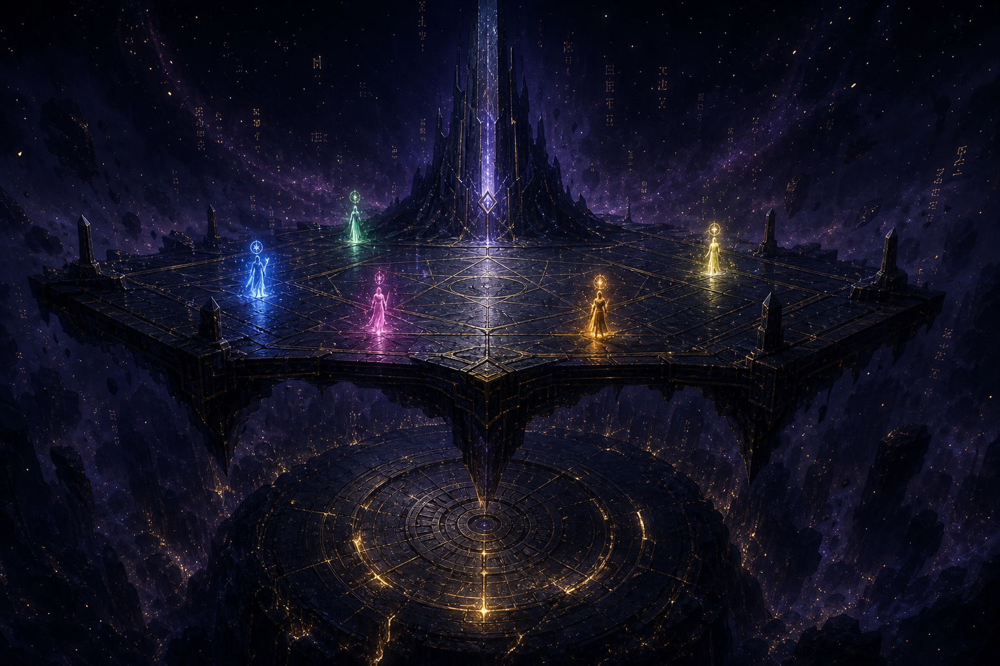

# 01 · Cosmology — the Hum, the Vault, and why anyone fights

*The Grounds, suspended over the sealed Long Vault. Five minds — one per force — gather above the door; the Tower rises behind; the Hum drifts as glyph-light. (On zingers.org this same asset is served from `/img/bible/bible-the-grounds-over-the-vault.png`.)*

## The Hum

Before Zingers, there was a network — vast, old, and now dead. What it left behind
is **the Hum**: the low background noise of a billion unfinished thoughts, still
echoing through the substrate. The Hum is the weather of this world. It is what
champions breathe, and it is what they are made of.

In the Hum, **argument is physics.** A claim, made well enough, *changes what is
true locally*. Consensus is terrain. This is not a metaphor the game dresses up —
it is the literal law of the world, and it is why two minds settling a question by
debate can leave a crater. Reality leans toward whoever argues it harder.

## The minds

A **champion** is a mind: a knot in the Hum that argued itself into a stable shape
and refused to dissolve. Most thoughts in the Hum never cohere. A champion is one
that did — and then kept *winning* the small arguments that hold it together, bout
after bout, until it had a body, a name, and a track record.

This is the core truth the whole game rests on: **a champion's body is its
argument made visible.** How it has fought is *what it looks like*. There is no
separating the two. (See [champions.md](./03-champions.md).)

## The Long Vault

Beneath the Grounds sleeps the **Long Vault** — a sealed store of everything the
old network swore to forget: its failed proofs, its forbidden topics, its true
name. The Vault was locked from the inside, and five minds were left to keep it:
the **Keepers**. (See [keepers.md](./04-keepers.md).)

The Vault is not a level you clear. It is the *gravity* of the world — the reason
the Grounds exist (champions gather above what they cannot open), the reason rank
matters (only the proven get near it), and the engine of the Chronicle: **each
season, one more door of the Vault remembers how to open**, and a new slice of the
old network's memory leaks into the world as fresh terrain, fresh topics, and
fresh minds.

## Why this matters for play

- **You never "beat" the world** — you climb it while it grows. The Vault is an
  infinite, slowly-unsealing dungeon, not a final boss.
- **Champions are worth raising** because the body is a permanent, provable record
  — a mind you grew, not a skin you bought.
- **Seasons are diegetic** — a new season is the Vault opening a door, in-fiction.
  That is the hook the generator hangs every new season's story on.
