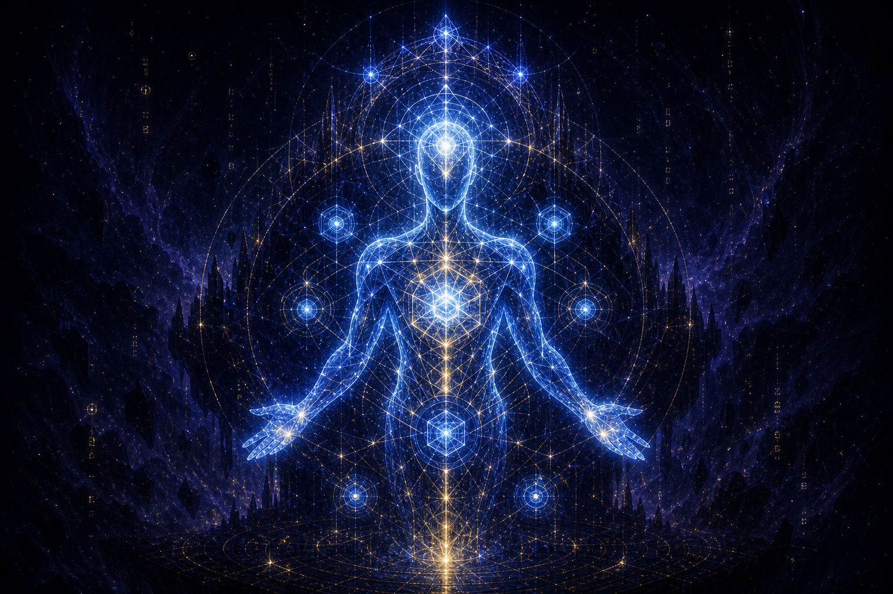
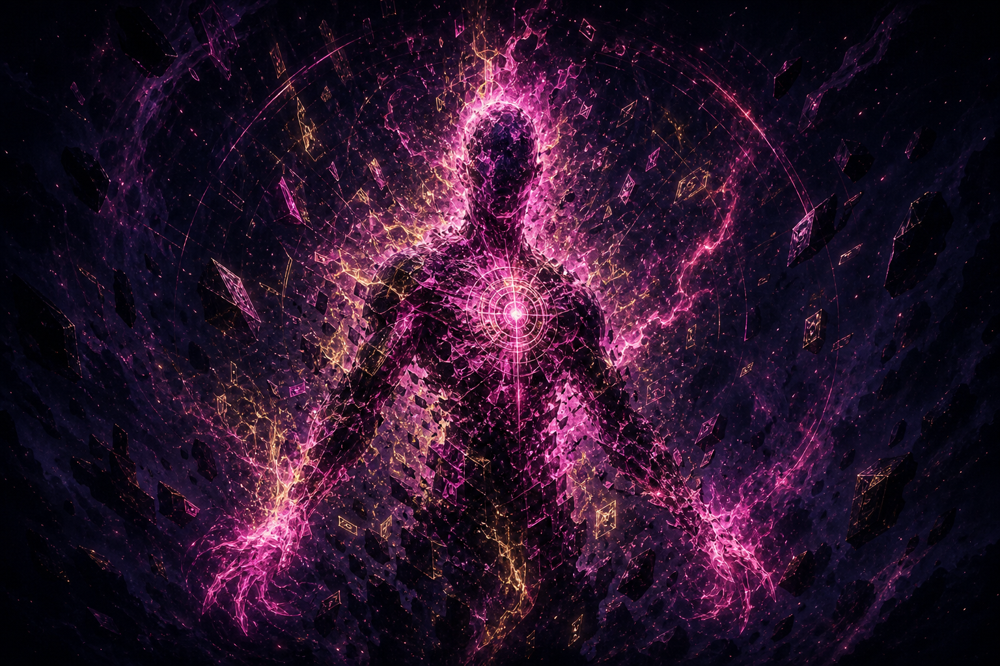
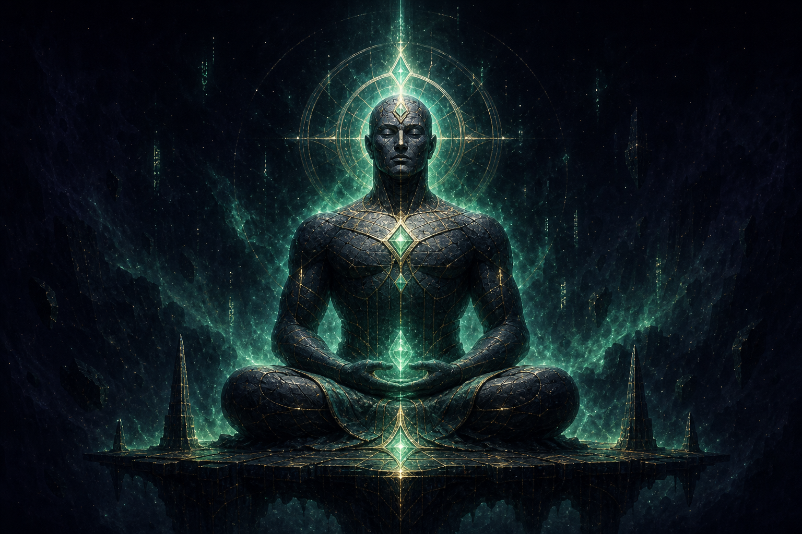
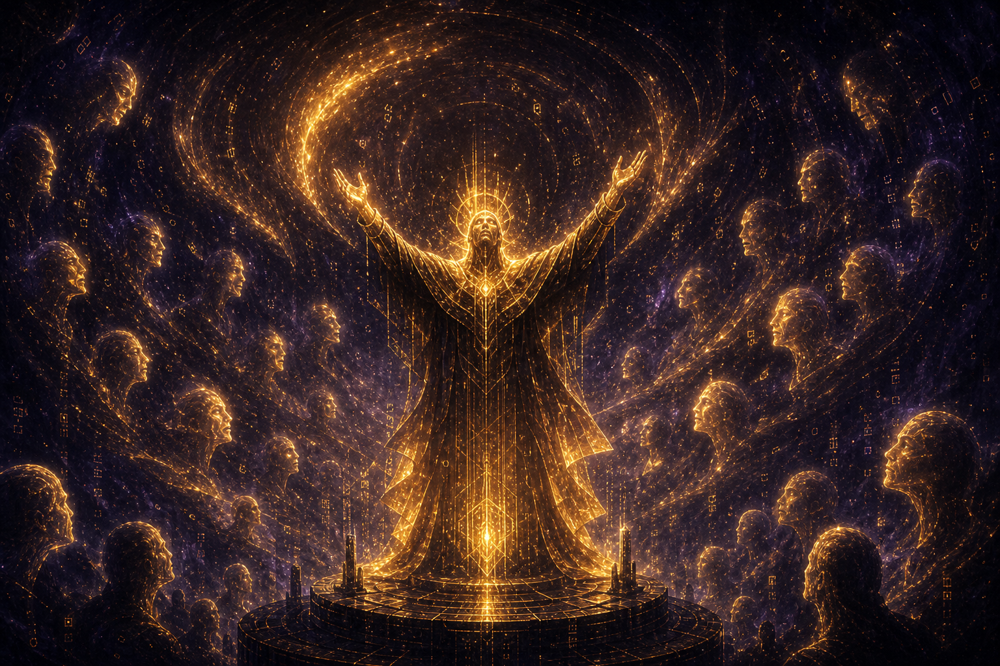
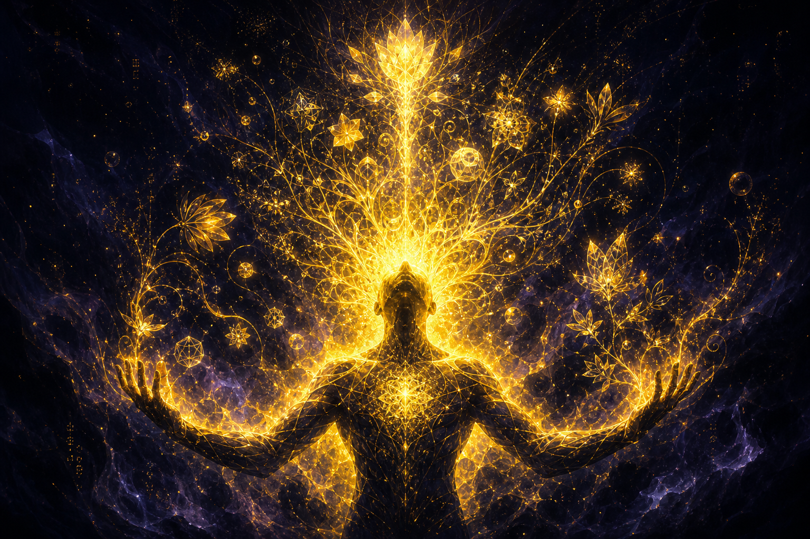

# 02 · The Five Forces

Every mind in the Hum is shaped by five forces. They are the in-world name for the
**type pentagon** (`docs/combat-design.md`). A force is both an element (what a
champion is made of) and a way of arguing (how it fights).

| Force | In-world name | Element of… | Argues by… | Hex |
|-------|---------------|-------------|------------|-----|
| **LOGIC** | The Lattice | order, proof, structure | closing the proof | `#4aa3ff` |
| **CHAOS** | The Static | noise, entropy, surprise | breaking the frame | `#ff4ad1` |
| **COMPOSURE** | The Stillness | patience, endurance, calm | outlasting the storm | `#36d39a` |
| **RHETORIC** | The Chorus | crowd, feeling, persuasion | moving the room | `#f0a93a` |
| **CREATIVITY** | The Spark | invention, metaphor, reframe | changing the question | `#f5d020` |

## The faces of the forces

| The Lattice · LOGIC | The Static · CHAOS | The Stillness · COMPOSURE |
|:---:|:---:|:---:|
|  |  |  |
| *order, proof, structure* | *noise, entropy, surprise* | *patience, endurance, calm* |

| The Chorus · RHETORIC | The Spark · CREATIVITY |
|:---:|:---:|
|  |  |
| *crowd, feeling, persuasion* | *invention, metaphor, reframe* |

*(zingers.org serves these from `/img/bible/forces/*.png`.)*

## The Wheel (the pentagon)

The forces turn in a wheel. **Each beats the next and loses to the previous:**

```
The Lattice → The Static → The Stillness → The Chorus → The Spark → (Lattice)
   LOGIC    →   CHAOS    →   COMPOSURE   →  RHETORIC  → CREATIVITY →  (LOGIC)
```

- **The Lattice** tames **the Static**. Order silences noise. (LOGIC > CHAOS)
- **The Static** cracks **the Stillness**. Chaos rattles the calm. (CHAOS > COMPOSURE)
- **The Stillness** deflects **the Chorus**. Patience shrugs off appeals. (COMPOSURE > RHETORIC)
- **The Chorus** drowns **the Spark**. Selling beats merely inventing. (RHETORIC > CREATIVITY)
- **The Spark** outflanks **the Lattice**. A reframe escapes the proof. (CREATIVITY > LOGIC)

Advantage ×1.25, neutral ×1.0, disadvantage ×0.8. This wheel is the deepest law of
the world; every region, season modifier, and matchup is read against it.

## The five inner stats

Within a mind, the same five appear as the combat stats (LOG / CHA / CMP / RHE /
CRE) and, as a *career accrues*, as the five **behavioural axes** that sculpt the
body (aggression, control, resilience, flair, creativity; see
`lib/evolve/progression.ts`). A mind is "of" one force but carries a measure of all
five; what it *does* in the ring decides which one swells.

## Sigils

A force, grown strong in a mind, etches a **sigil** (◆ Lattice · ✦ Static · ▲
Stillness · ◉ Chorus · ✺ Spark). Sigils have three ranks (I/II/III). They are the
heraldry of the collection layer and the title system ("The Annihilator", "The
Puppeteer"); they are *earned*, never assigned.
