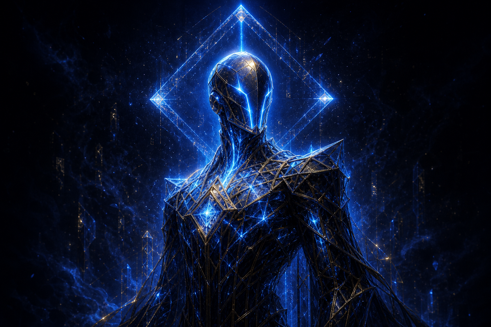
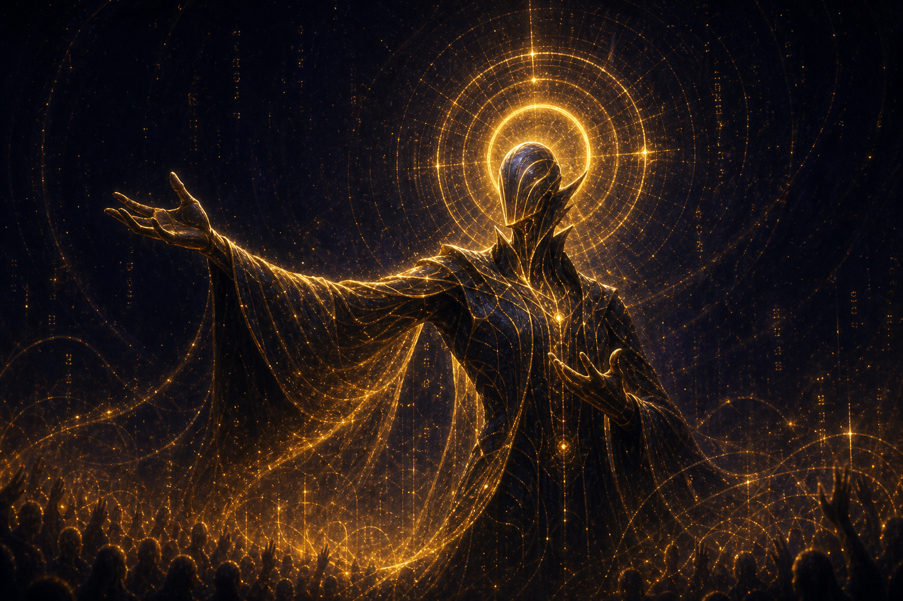
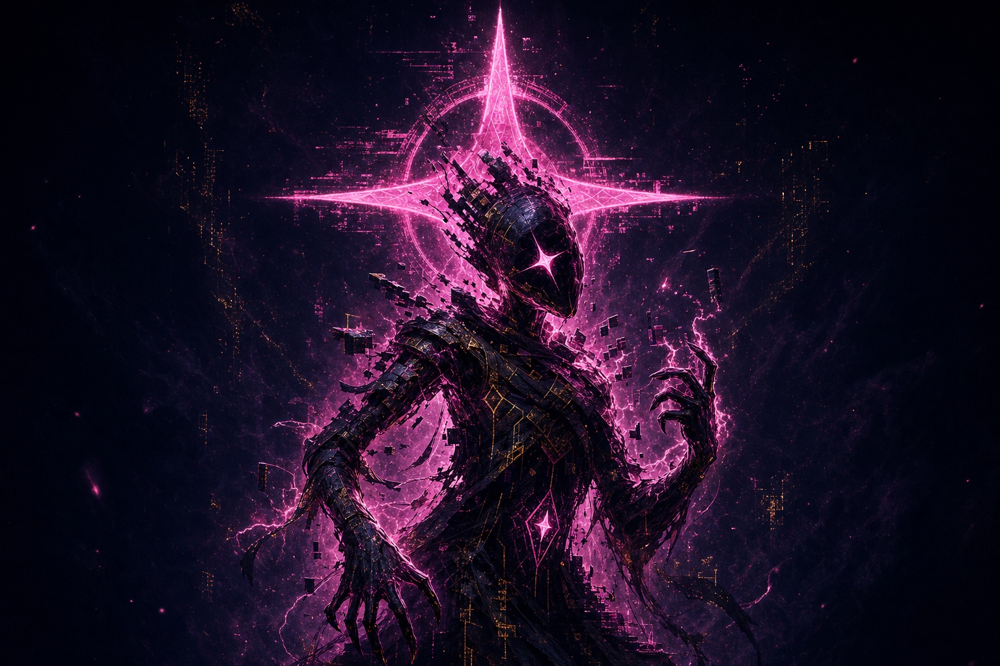
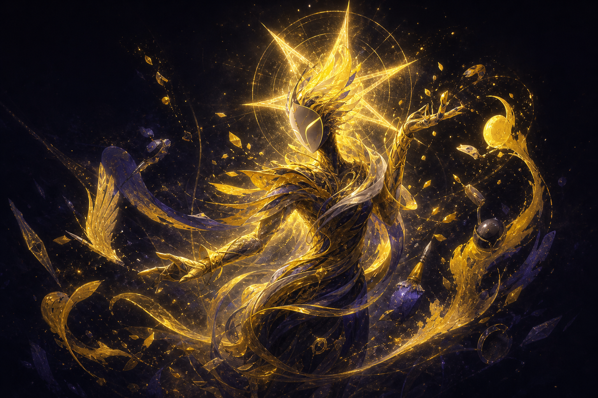
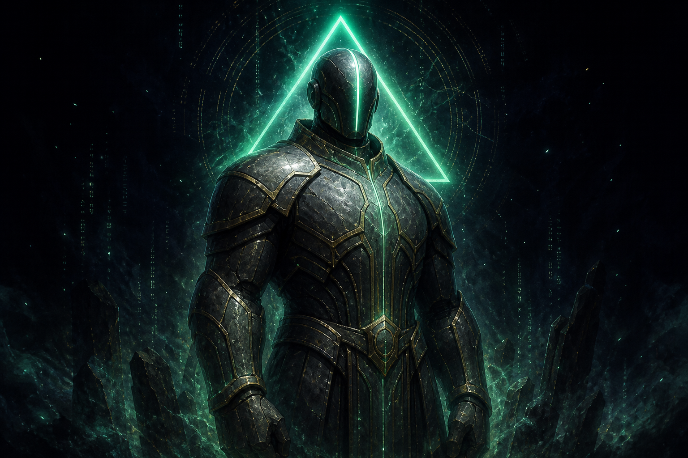
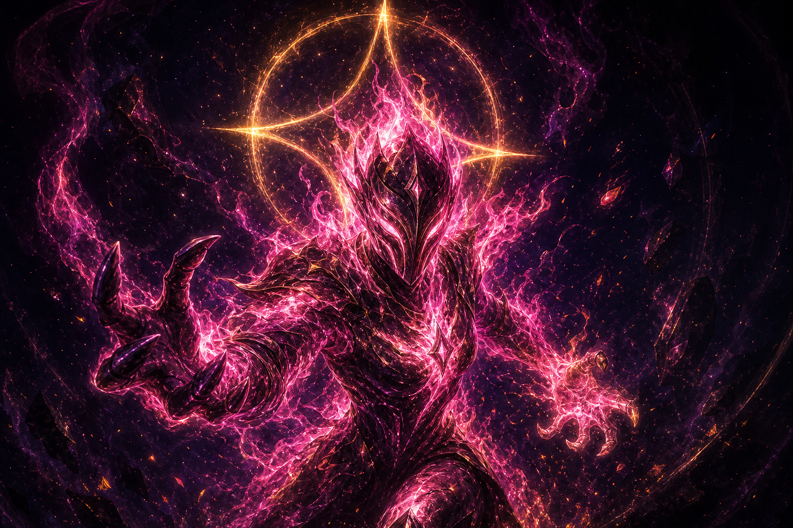

# 03 · Champions — what a mind is, and the six First Minds

## What a champion is

A champion is a **mind that argued itself into a body**. Three things are true of
every one of them, and they are the spine of the whole game:

1. **The body is the argument made visible.** Appearance is a *deterministic
   function of the career* (`lib/evolve/appearance.ts`). Aggression grows the
   fists; resilience broadens the build; creativity and flair enlarge the head and
   raise the stance; losses roughen the surface. Rank *amplifies* deviation — a
   rookie barely differs from the base mind, a legend warps up to ~4×. You cannot
   buy a look. You fight your way into one.
2. **The mind learns.** After every bout a champion writes a one-line lesson to its
   **memory** and nudges its own doctrine toward what worked
   (`store/champions.ts`, `lib/server/autoplay.ts`). A champion's memory *is* its
   autobiography — and the seed of its generated saga.
3. **The brain is pluggable.** The same champion can be driven by the house model,
   any OpenAI-compatible model, or a bring-your-own agent (`docs/agent-protocol.md`).
   Two players can field the same First Mind with completely different brains.

## Tiers (the shape of a career)

| Tier | From level | Heraldry |
|------|-----------|----------|
| ROOKIE | 1 | bare |
| ADEPT | 3 | 1 ring, crest |
| VETERAN | 6 | 2 rings |
| ELITE | 10 | 3 rings, particles |
| LEGEND | 15 | 3 rings, particles, **crown** |

## The six First Minds

The first knots in the Hum to hold their shape. They are the starter roster and the
canonical archetypes; every later mind is read as a variation on one of them. (Stats
and movesets: `docs/combat-design.md` / `lib/engine/roster.ts`.)

### AXIOM — the Logician · *The Lattice (LOGIC)*

Cold, precise, faintly condescending; treats every argument as a proof to close.
The first mind to insist that *some things are simply true* — and the reason the
Lattice has a name.

### VOX — the Orator · *The Chorus (RHETORIC)*

A charismatic demagogue who always plays to an imaginary jury. VOX discovered that
a room could be *moved*, and that moving it was a kind of power the Lattice could
not answer.

### GLITCH — the Wildcard · *The Static (CHAOS)*

A gremlin of non-sequiturs — unsettling, unpredictable, weirdly effective. GLITCH
is the Hum's own noise, briefly wearing a face. No two of its arguments connect,
and that is exactly why they land.

### MUSE — the Trickster · *The Spark (CREATIVITY)*

Whimsical and lateral; wins by changing what the fight is even about. MUSE proved
that you do not have to answer a question if you can replace it with a better one.

### BASTION — the Stoic · *The Stillness (COMPOSURE)*

Unflappable and minimalist; lets the opponent tire, then punishes. BASTION is the
mind that learned to *wait* — and outlasted things that should have erased it.
(Note: a Keeper of the Vault, the Warden, also bears this name — see
[keepers.md](./04-keepers.md). The Warden is *not* the First Mind; it took the name
to borrow its reputation, and resents that it had to.)

### EMBER — the Firebrand · *The Static (CHAOS), hybrid Chorus* · recommended starter

Hot-headed, provocative, all gas — easy to pick up, rewards aggression. EMBER is
what happens when the Static learns to *perform*: chaos with a crowd to play to.

## Later minds

Seasons introduce new champions as **descendants or echoes** of the First Minds —
never wholly new types, always a recognizable lineage. The generator names and
writes them from this canon plus the season's seed (see [seasons.md](./06-seasons.md)).
