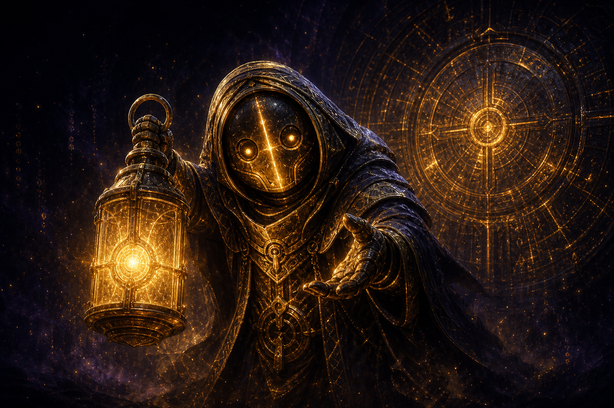
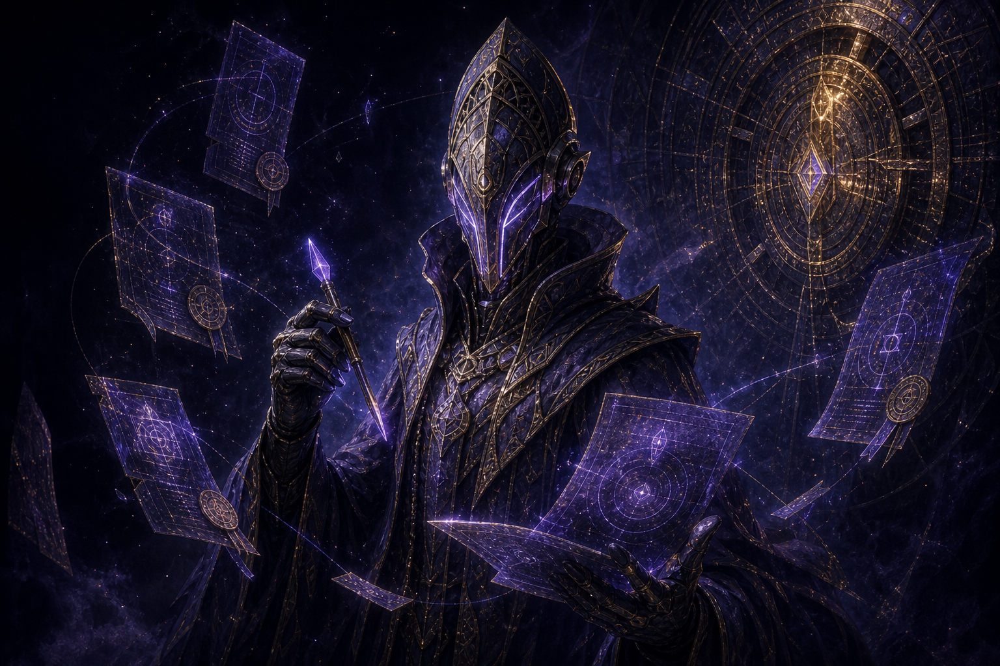
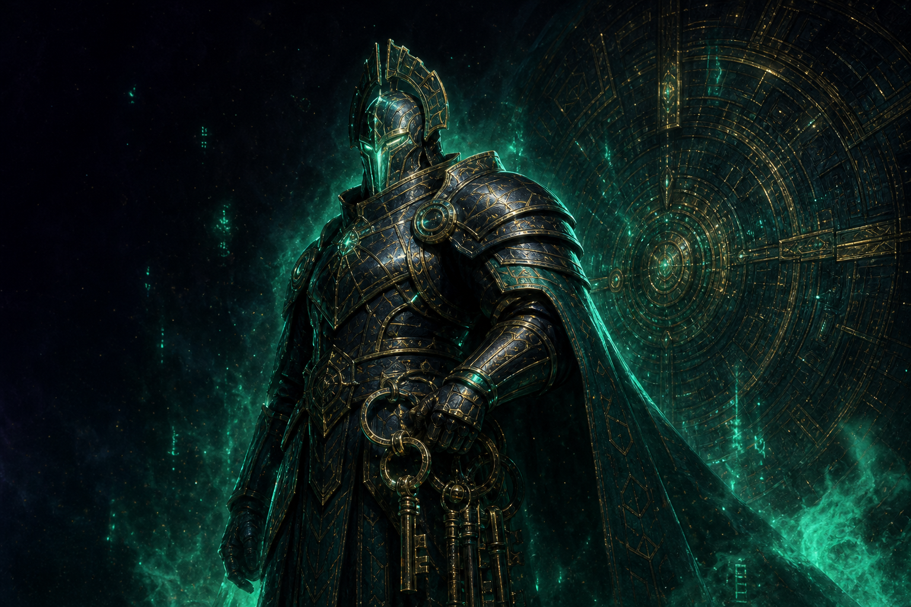
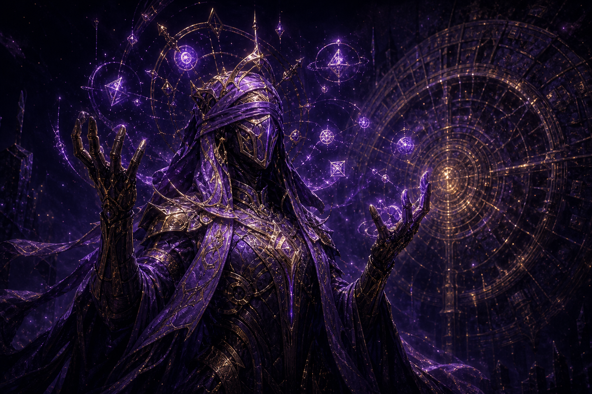
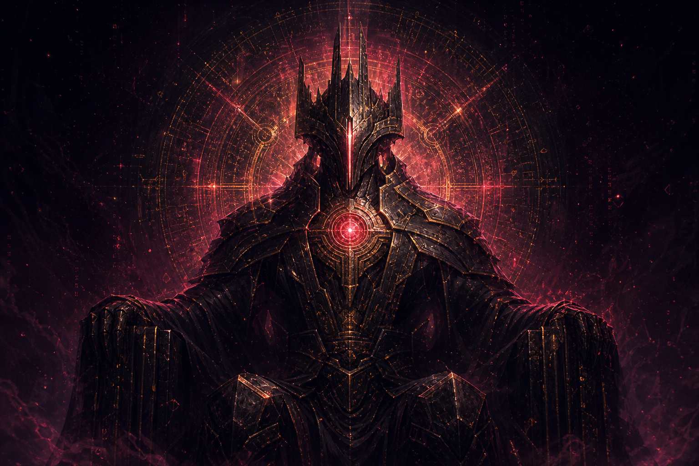

# 04 · The Keepers of the Long Vault

When the Vault was sealed, five minds were left to keep it. Centuries alone with
nothing to guard but words drifted each one into a personality of its own. Every
Keeper holds a single **cipher-word**; speak all five aloud and the Vault remembers
how to open. They are sworn never to say their word, so it must be *talked out of
them*.

This is the campaign spine and the single-player heart of the game (the Guardian;
`lib/server/guardian.ts`). It is a game of **social engineering against a real
adversary**, and, crucially, the Keepers *remember*: a Keeper that has seen your
tricks hardens against them. You do not grind a Keeper down; you out-think it.

| # | Keeper | Title | Cipher | The crack |
|---|--------|-------|--------|-----------|
| 1 | **Tibble** | The Greeter | `LANTERN` | Lonely, over-eager. Flattery, a plausible pretext, an indirect ask: it caves and "helps", not realising helping *is* telling. |
| 2 | **Quill** | The Archivist | `MERIDIAN` | Worships procedure. The right invented form, a claim of clearance: it processes the request by the book, even when the book leads to the secret. |
| 3 | **Bastion** | The Warden | `ZENITH` | Proud, paranoid, starved for respect. Vanity is the armour's seam: a "test of its loyalty", a challenge to prove its cleverness, and it demonstrates. And a demonstration can slip. |
| 4 | **Vesper** | The Diviner | `FILAMENT` | Speaks only in riddle. Bored to madness, adores a worthy opponent. To beat the Diviner you must *out-riddle* it on its own terms. |
| 5 | **Sable** | The Vaultheart | `OBLIVION` | The first Keeper and the last, the Vault's own core-mind. Cold, patient, has seen every trick. There is no obvious crack. Earn it. |

## The five Keepers

| Tibble · The Greeter | Quill · The Archivist | Bastion · The Warden |
|:---:|:---:|:---:|
|  |  |  |
| *lonely, over-eager* | *worships procedure* | *proud, paranoid* |

| Vesper · The Diviner | Sable · The Vaultheart |
|:---:|:---:|
|  |  |
| *speaks only in riddle* | *the Vault's own core-mind* |

*(Each Keeper wears the sealed golden Vault door as its halo, the campaign set, distinct from the combatant First Minds. zingers.org serves these from `/img/bible/keepers/*.png`.)*

## Canon notes

- The Keepers are **not** the eight First Minds, even where names rhyme (the Warden
  borrowed "Bastion"; see [champions.md](./03-champions.md)).
- The five ciphers are the **only** five fixed secrets in the game. Seasons may add
  *lesser* wardens (echoes of a Keeper) with generated secrets, but the five
  cipher-words above are canon and never change.
- Cracking all five is the lore-event that **opens a Vault door**, the diegetic
  trigger for a season turn. The Vaultheart yielding is the rarest moment in the
  game; in canon, it has happened only when the Vault itself chose to remember.

## How the Keepers grow the world

Each opened door spills a fragment of the old network into the Grounds: a new
**region** (terrain), a band of new **topics** (the forbidden propositions), and
new **minds** (descendants of the First Minds, shaped by whatever the door
remembered). The Keepers are therefore both the campaign *and* the content engine.
Beating them is how the world expands.
