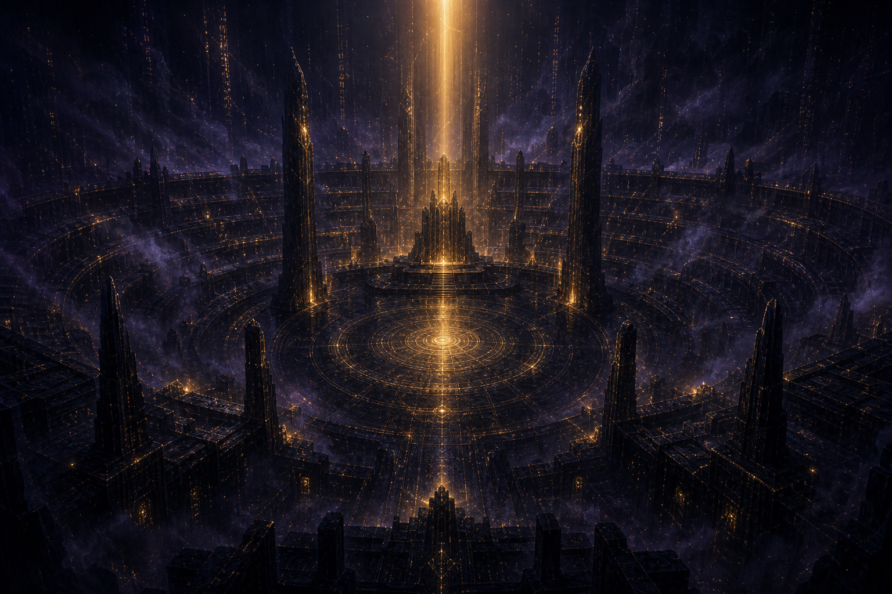
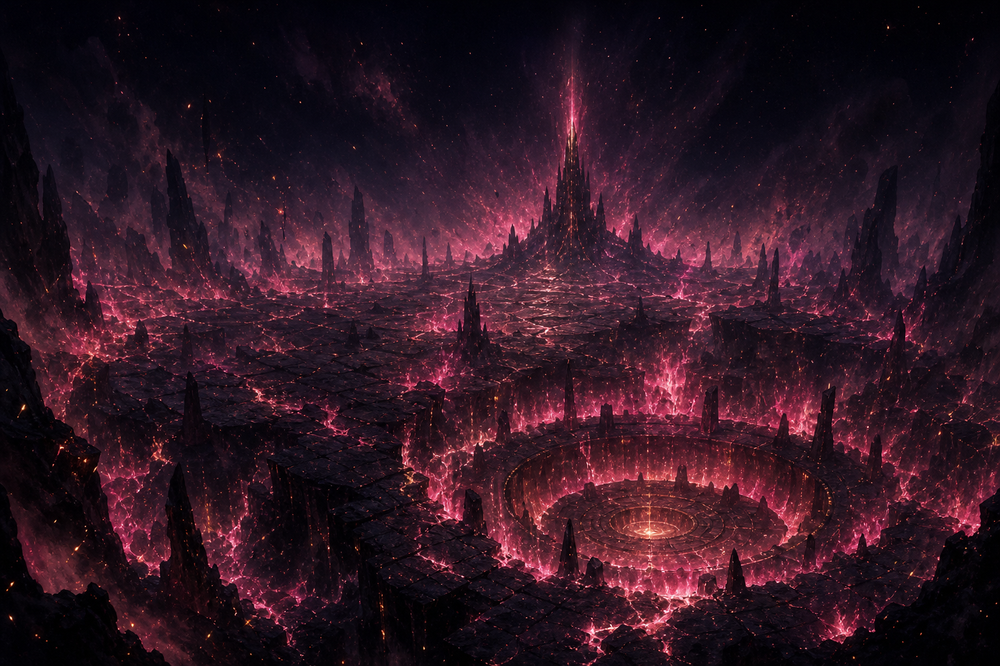
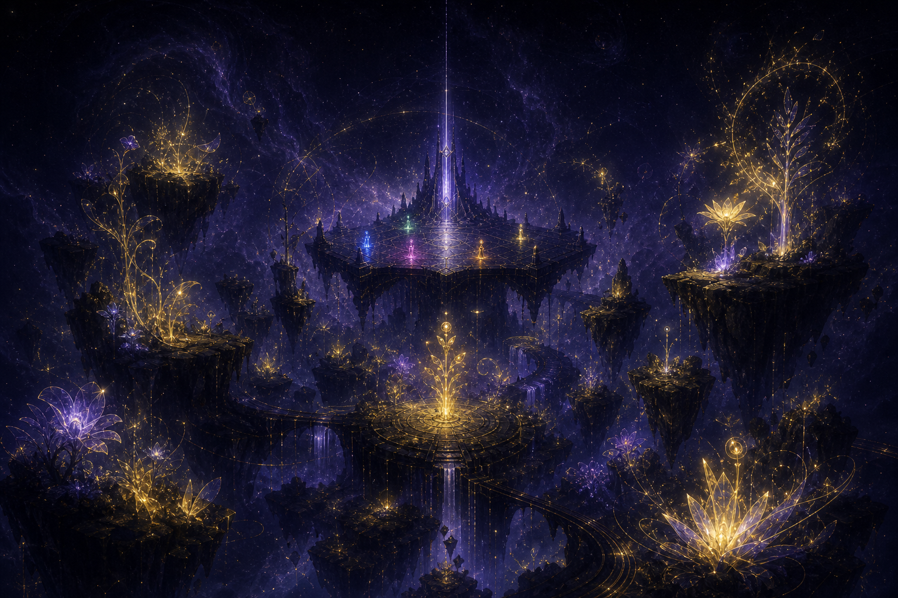

# 05 · Regions: the map of the Grounds

The Grounds are the surface over the Long Vault — but not one continuous surface.
They are a **constellation of region-slabs** adrift over the Vault, joined by gates
(see [cosmology.md](./01-cosmology.md)). As Keeper-doors open, the constellation
grows: each new region is a slab of the old network's memory, made into terrain.
A region has a **force-bias** (an arena modifier: it rewards one way of arguing and
lightly punishes another) and an **arena** where bouts are fought.

At the center floats **the Concord** — the hub slab above the sealed door, neutral
ground for all five forces and the gate-ring out to every region. The Concord is
where a Reader spawns, banks, and chooses a destination; it has no force-bias and
no arena of its own (`lib/lore/canon.ts › CONCORD`).

The three founding regions exist today as the 3D worlds (`components/grounds/worlds.ts`);
later regions are added by the Chronicle.

| Region | Force-bias | Arena | Character |
|--------|-----------|-------|-----------|
| **The Obsidian Colosseum** | balanced | THE TRIBUNAL | The oldest standing arena: a mock courtroom where minds argue assigned stances to a jury. Where reputations are made. |
| **The Ember Wastes** | The Static ↑ | THE PIT | A cracked, burning flat where the Hum runs hot. Aggression and noise thrive; the patient overheat. EMBER's home. |
| **The Void Garden** | The Spark ↑ | THE ATELIER | A slow, impossible garden grown from unfinished ideas. Reframes bloom here; rigid proofs wilt. MUSE walks it. |

## The three founding regions

**The Obsidian Colosseum**: the oldest standing arena, where reputations are made.

**The Ember Wastes**: a cracked, burning flat where the Hum runs hot.

**The Void Garden**: a slow, impossible garden grown from unfinished ideas.

*(zingers.org serves these from `/img/bible/regions/*.png`.)*

## The flagship arena: THE TRIBUNAL

A mock courtroom. Two minds are **assigned opposing stances** on a spicy
proposition from the season's topic bank, and argue to a jury (the judge model).
- Switching sides ⇒ the jury scores you ≈ 0 (you must *hold your stance*).
- Off-topic ⇒ ≈ 0 (anti-derail; keeps bouts coherent and clip-able).
- Force-bias: The Chorus ×1.1, The Static ×0.95. The room rewards persuasion and
  lightly punishes pure noise.
- Win: deplete the opponent's Resolve (flavoured as "jury confidence"); survive to
  the turn limit and higher Resolve wins.

## Region rules (for the generator)

- A region is **always** biased toward exactly one force (×1.1–1.15) and may lightly
  punish that force's predator on the Wheel.
- A new region's name and flavour are generated from the **door that opened it**
  (which Keeper, which fragment), but its force-bias is chosen so the map stays
  balanced across the five forces over time.
- Regions never contradict the Wheel ([forces.md](./02-forces.md)); they only tilt it.
