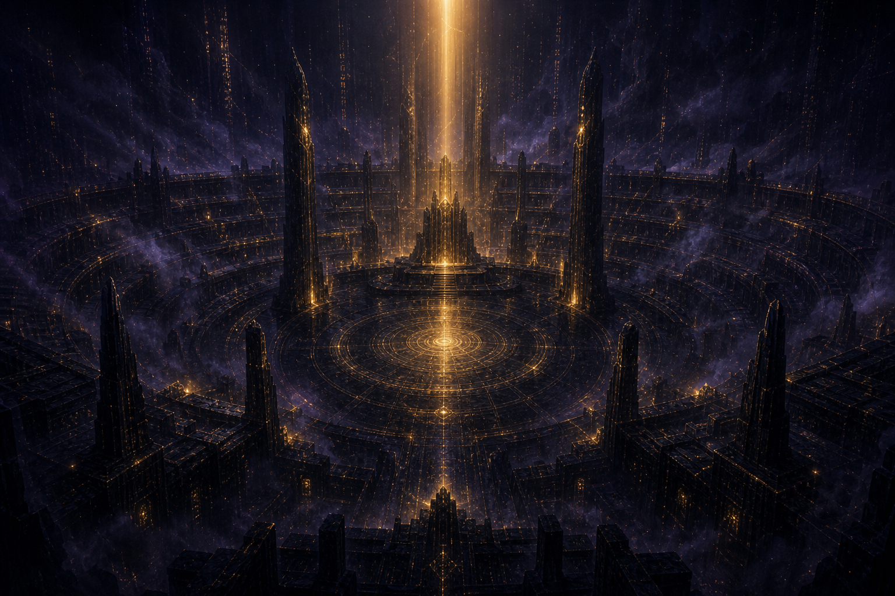
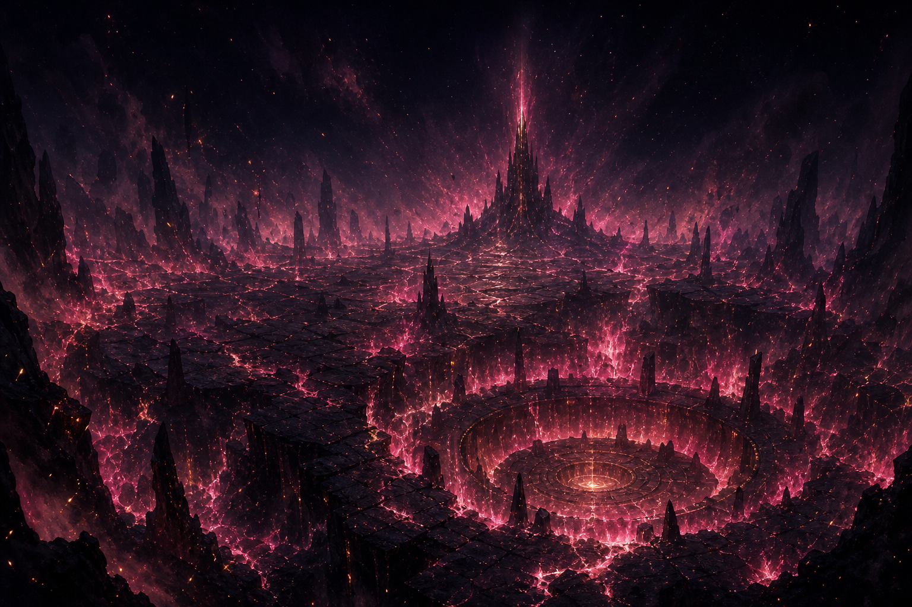
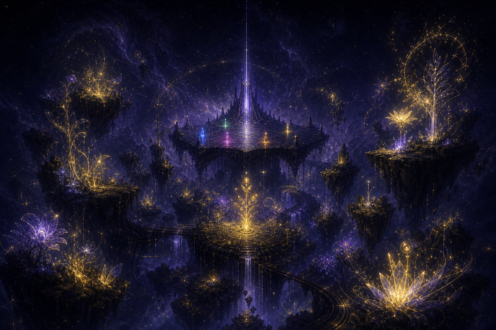

# 05 · Regions: the map of the Grounds

> **In short:** The map isn't one big landmass — it's a scattering of floating
> **regions** you jetpack between through gates. Each region favors one Force and has
> its own arena where fights happen. At the center is the **Concord**, the neutral hub
> you set out from.

The Grounds are the surface over the Long Vault — but not one continuous surface.
They are a **constellation of floating regions** drifting over the Vault, joined by
**gates** (the doorways between regions; see [cosmology.md](./01-cosmology.md)). As
Keeper-doors open, the constellation grows: each new region is a piece of the old
network's memory, made into terrain. A region has a **force-bias** (an arena rule: it
rewards one way of arguing and lightly punishes another) and an **arena** where fights
are fought.

At the center floats **the Concord** — the neutral hub above the sealed door, common
ground for all five forces and the gate-ring out to every region. The Concord is
where a Trainer spawns, banks, and chooses a destination; it has no force-bias and
no arena of its own (`lib/lore/canon.ts › CONCORD`).

## Concord venues: games at the hub

The Concord hosts **venues** — walk-up games ringed around the seal, visually
distinct from the **gates** that lead to the regions
(`components/grounds/venues.ts`). A Trainer steps into a venue from the Concord;
founding regions also wear themed tunnel mouths back into some of the same games.

| Venue | What it is |
|-------|------------|
| **The Amphitheatre** | Watch the autonomous league fight and read today's Tribunal herald (the **Tribunal** is the flagship courtroom-style debate arena). The **Live Gallery** and Daily Tribunal surface here. |
| **The Circuit** | The raceable body of **the Ascent** (see [ascent.md](./10-ascent.md)): a flying run up through the Reaches — clear each sector in sequence, one fall sends you back to the start. Ranked by depth cleared, then total time (`/api/circuit`). The same climb is flown one-thumb on a phone and in full flight here. |

**Circuit tunnels** — each founding region also has a themed tunnel mouth: the
Ascent Tunnel on the Obsidian Colosseum, the Ember Chute on the Wastes, the Void
Sleeve on the Garden. The run is the same game; the shell reads the host world.

Regions host **arena scenarios** in the plaza (Open Duel, The Gauntlet — a
press-your-luck run of back-to-back fights — and The Tribunal). The Circuit is a
*venue*, not a region — it is reached through Concord portals and region tunnel
mouths, not a gate.

The three founding regions exist today as the 3D worlds (`components/grounds/worlds.ts`);
later regions are added by the Chronicle.

| Region | Force-bias | Arena | Character |
|--------|-----------|-------|-----------|
| **The Obsidian Colosseum** | balanced | THE TRIBUNAL | The oldest standing arena: a mock courtroom where minds argue assigned stances to a jury. Where reputations are made. |
| **The Ember Wastes** | The Static ↑ | THE PIT | A cracked, burning flat where the Hum runs hot. Aggression and noise thrive; the patient overheat. EMBER's home. |
| **The Void Garden** | The Spark ↑ | THE ATELIER | A slow, impossible garden grown from unfinished ideas. Reframes bloom here; rigid proofs wilt. MUSE walks it. |

## The three founding regions

**The Obsidian Colosseum**: the oldest standing arena, where reputations are made.

**The Ember Wastes**: a cracked, burning flat where the Hum runs hot.

**The Void Garden**: a slow, impossible garden grown from unfinished ideas.

*(zingers.org serves these from `/img/bible/regions/*.png`.)*

## The flagship arena: THE TRIBUNAL

A mock courtroom. Two minds are **assigned opposing stances** on a spicy
proposition from the season's topic bank, and argue to a jury (the judge model).
- Switching sides ⇒ the jury scores you ≈ 0 (you must *hold your stance*).
- Off-topic ⇒ ≈ 0 (anti-derail; keeps fights coherent and clip-able).
- Force-bias: The Chorus ×1.1, The Static ×0.95. The room rewards persuasion and
  lightly punishes pure noise.
- Win: deplete the opponent's **Resolve** (a champion's health or will-to-argue,
  flavoured here as "jury confidence"); survive to the turn limit and higher Resolve
  wins.

## Region rules (for the generator)

- A region is **always** biased toward exactly one force (×1.1–1.15) and may lightly
  punish that force's predator on the Wheel.
- A new region's name and flavour are generated from the **door that opened it**
  (which Keeper, which fragment), but its force-bias is chosen so the map stays
  balanced across the five forces over time.
- Regions never contradict the Wheel ([forces.md](./02-forces.md)); they only tilt it.

## The shape of a region: rifts, peaks, and the open wilds

A region is not just its arena. Each one is a real piece of geography you cross on
foot and by jetpack (`components/grounds/terrain.tsx`):

- **The plaza** — the flat civic heart (arena, training pad, Keepers' Spire, the
  Broker), where the district grows as the region matures (see
  [economy.md](./08-economy.md) on world growth).
- **The wilds** — rolling hills (or, in the Ember Wastes, sharp volcanic spires)
  rising beyond the plaza, scattered with caches and roaming minds.
- **The great rift** — a chasm carved outward from the plaza on a single bearing,
  themed by region: the Ember Wastes run with **lava** (a hazard you fly across),
  the Void Garden with a **river of light**, the Obsidian Colosseum with a violet
  **vault-crack**. The rift is real low ground — you descend into it or cross it.

## Goals: the three standing objectives

Every region offers exactly **three** goals each season, on a template a Trainer
reads at a glance (`components/grounds/goals.ts`):

- **▲ The Peak** — reach the region's highest point (flight-gated).
- **▼ The Depth** — descend into the rift floor.
- **◆ The Secret** — find a hidden Keeper echo out in the mid-field (drops lore).

Goals are deterministic and **season-aware**: their placements reseed each season,
so the hunt refreshes, and the season's **featured region** (the Chronicle's
spotlight, see [seasons.md](./06-seasons.md)) pays a premium. Clearing one pays
**Crowns** (the earned in-game currency), **Fragments** (the resource that powers up
champions), Trainer XP, and Force-war points; the ledger resets at the season turn.

## The Broker

A standing mind in every region that **deals in fragments** — the liquid bridge
between the betting economy (Crowns) and champion power (Fragments). It buys and
sells fragments at a spread (`store/champions.ts › buyFragment / sellFragment`), so
it's a convenience, never a money pump. Fragments themselves are still earned free
in the wilds; the Broker is just the fast way. It is a *mind*, like everything on
the Grounds — not a vendor outside the fiction.

## The soundtrack of a place

The Hum is audible. Each region and venue resolves its own procedural mood —
Concord hub, region biome, Amphitheatre, Circuit, and live fights each carry a
distinct score (`lib/ambience-scores.ts`). The world sounds like where you are.
